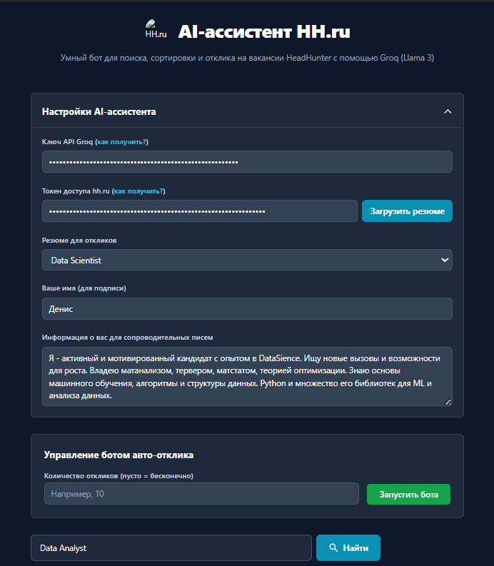

# AI-ассистент для hh.ru на базе Groq (Llama 3)

 

Это продвинутый бот-ассистент для автоматизации поиска работы на HeadHunter. Он использует мощь и скорость Groq API с моделью Llama 3 для анализа вакансий, генерации персонализированных сопроводительных писем и автоматического отклика.

## 🚀 Ключевые возможности

-   **🤖 Умный поиск:** AI расширяет ваш поисковый запрос синонимами и релевантными технологиями для максимального охвата.
-   **🎯 AI-фильтрация:** Бот анализирует найденные вакансии и отсеивает нерелевантные, оставляя только те, что точно соответствуют вашему запросу.
-   **✍️ Персональные сопроводительные письма:** Для каждой вакансии генерируется уникальное, краткое и профессиональное сопроводительное письмо на основе вашего резюме и описания вакансии.
-   **⚙️ Два режима работы:**
    -   **Ручной:** Находите вакансии и откликайтесь на них в один клик с помощью AI.
    -   **Автоматический:** Запустите бота, и он будет сам искать вакансии, писать письма и отправлять отклики.
-   **🛡️ Безопасность и этика:** Встроенные случайные задержки между откликами и проверка, чтобы не откликаться на одну и ту же вакансию дважды.
-   **📊 Приоритетный поиск:** Сначала ищутся вакансии в г. Ставрополь, а затем — с удаленным форматом работы по всей России.
-   **🔧 Гибкие настройки:** Управляйте API-ключами, выбирайте резюме, настраивайте информацию о себе и имя для подписи в письмах.

## 🛠️ Технологический стек

-   **Frontend:** React, TypeScript, Tailwind CSS
-   **AI:** Groq API (модель Llama 3 70b)
-   **API:** HeadHunter (hh.ru) API
-   **Среда выполнения:** Прямо в браузере, без необходимости в серверной части.

## ⚙️ Установка и запуск

Поскольку это клиентское приложение, для его запуска не требуется сложная настройка.

### Шаг 1: Получение ключей API

Вам понадобятся два ключа для работы ассистента:

1.  **Groq API Key:**
    -   Перейдите на [Groq Console](https://console.groq.com/keys).
    -   Зарегистрируйтесь или войдите в аккаунт.
    -   Создайте новый ключ API и скопируйте его.

2.  **Токен доступа hh.ru:**
    -   Перейдите в раздел [Управление приложениями на hh.ru](https://dev.hh.ru/admin).
    -   Создайте новое приложение. Укажите `https://localhost` или любой другой URL в поле "Redirect URI".
    -   После создания приложения вы сможете получить токен доступа для вашего аккаунта. Скопируйте его.

### Шаг 2: Запуск проекта

1.  Клонируйте репозиторий:
    ```bash
    git clone https://github.com/ВАШ_НИКНЕЙМ/НАЗВАНИЕ_РЕПОЗИТОРИЯ.git
    ```
2.  Перейдите в папку проекта:
    ```bash
    cd НАЗВАНИЕ_РЕПОЗИТОРИЯ
    ```
3.  Откройте файл `index.html` в вашем браузере. Для избежания проблем с CORS рекомендуется использовать локальный веб-сервер. Самый простой способ — использовать `npx`:
    ```bash
    npx serve
    ```
    После этого откройте в браузере адрес, который покажет команда (обычно `http://localhost:3000`).

## 🚀 Как пользоваться

1.  **Настройка:**
    -   На главной странице откройте раздел "Настройки AI-ассистента".
    -   Вставьте ваш **Ключ API Groq** и **Токен доступа hh.ru**.
    -   Нажмите кнопку **"Загрузить резюме"**. Ваше резюме должно появиться в выпадающем списке. Выберите нужное.
    -   Укажите **"Ваше имя"** — оно будет использоваться для подписи в сопроводительных письмах.
    -   (Опционально) Отредактируйте поле **"Информация о вас"**, чтобы AI лучше понимал ваши сильные стороны.

2.  **Ручной режим:**
    -   Введите поисковый запрос (например, "Frontend-разработчик") и нажмите "Найти".
    -   Ассистент найдет и отфильтрует вакансии.
    -   Нажмите на кнопку **"Откликнуться с AI"** на понравившейся вакансии. Бот сгенерирует письмо и отправит отклик.

3.  **Автоматический режим:**
    -   Сначала выполните поиск, чтобы задать направление для бота.
    -   В блоке "Управление ботом" укажите желаемое количество откликов (или оставьте поле пустым для бесконечной работы).
    -   Нажмите **"Запустить бота"**.
    -   Вы можете следить за его работой в окне логов внизу страницы.

## 🧠 Пример системного промпта

Вот основной системный промпт, который используется для генерации сопроводительного письма. Это "мозг" ассистента.

```text
You are a professional career assistant. Your task is to write a personalized, concise, energetic, and highly professional cover letter in Russian based on the vacancy details.

CRITICAL INSTRUCTIONS:
- Your response MUST contain ONLY the cover letter text itself. Do not add any introductory phrases, explanations, conversational filler, or concluding remarks. Your entire output must be the letter itself, ready to be sent.
- The letter must be written exclusively in correct Russian. Do not include any foreign characters, hieroglyphs, or technical artifacts.
- The candidate is NOT willing to relocate or go on business trips. Under no circumstances should you mention relocation or business travel as possibilities.

KEY RULES:
- Style: Concise, to the point, no fluff.
- Opening: Get straight to the point. Do not use phrases like "пишу вам, чтобы" or "увидел вашу вакансию". Start with the main thing. For example: "Добрый день! Меня заинтересовала ваша вакансия...".
- Body: Based on the provided vacancy description and candidate info, very briefly (1-2 sentences) connect the candidate's experience with the key requirements of the vacancy.
- Length: Maximum 2-3 short paragraphs.
- Closing: You MUST end the letter with a polite closing followed by the User's Name. The User's Name will be provided in the user prompt. For example: "С уважением, Денис".
- Tone: Confident and professional.